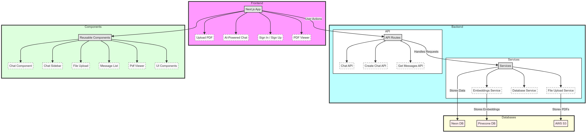

# IntelliPDF

Welcome to the **IntelliPDF** application! This app allows users to upload a PDF and chat with an AI to get answers based on the content of the PDF.

## Features

- **Upload PDF**: Easily upload your PDF documents.
- **AI-Powered Chat**: Interact with an AI that can answer questions based on the content of your PDF.
- **Secure Storage**: Your PDFs are securely stored in AWS S3.
- **Efficient Data Handling**: Utilizes Pinecone DB for fast and efficient data retrieval.
- **Modern UI**: A clean and responsive interface built with Next.js, TailwindCSS, and Shadcn/ui.

## Tech Stack

- **Frontend**: [Next.js](https://nextjs.org/)
- **Database ORM**: [DrizzleORM](https://github.com/drizzle-team/drizzle-orm)
- **Styling**: [TailwindCSS](https://tailwindcss.com/)
- **UI Components**: [Shadcn/ui](https://ui.shadcn.dev/)
- **File Storage**: [AWS S3](https://aws.amazon.com/s3/)
- **Vector Database**: [Pinecone DB](https://www.pinecone.io/)
- **Relational Database**: [Neon DB](https://neon.tech/)

## Architecture




## Getting Started

### Prerequisites

- Node.js (>=14.x)
- npm/yarn/pnpm/bun
- AWS account with S3 access
- Pinecone DB account
- Neon DB account

### Installation

1. **Clone the repository**:

    ```bash
    git clone https://github.com/sid995/IntelliPDF.git
    cd IntelliPDF
    ```

2. **Install dependencies**:

    ```bash
    npm install
    ```

    or

    ```bash
    yarn install
    ```

    or

    ```bash
    bun install
    ```

    or 

    ```bash
    pnpm install
    ```

3. **Set up environment variables**:

    Create a `.env.local` file in the root directory and add the following:

    ```plaintext
    NEXT_PUBLIC_CLERK_PUBLISHABLE_KEY=your_clerk_publish_key
    CLERK_SECRET_KEY=your_clerk_secret_key
    NEXT_PUBLIC_CLERK_SIGN_IN_URL=sign_in_page
    NEXT_PUBLIC_CLERK_SIGN_UP_URL=sign_up_page
    NEXT_PUBLIC_CLERK_AFTER_SIGN_IN_URL=after_sign_in_url
    NEXT_PUBLIC_CLERK_AFTER_SIGN_UP_URL=after_sign_up_url
    DB_URL=your_neon_db_url
    NEXT_PUBLIC_S3_ACCESS_KEY_ID=your_aws_access_key_id
    NEXT_PUBLIC_S3_SECRET_ACCESS_KEY=your_aws_secret_access_key
    NEXT_PUBLIC_S3_BUCKET_NAME=your_s3_bucket_name
    PINECONE_REGION=your_pinecone_environment
    PINECONE_API=your_pinecone_api_key
    NEXT_PUBLIC_OPENAI_API_KEY=your_openai_key
    ```

4. **Run the development server**:

    ```bash
    npm run dev
    ```

    or

    ```bash
    yarn dev
    ```

    Open [http://localhost:3000](http://localhost:3000) with your browser to see the result.

## Deployment

### Vercel

The app is designed to be easily deployable on Vercel.

1. **Push to GitHub**:

    ```bash
    git push origin main
    ```

2. **Import your repository** to Vercel.

3. **Add Environment Variables** in the Vercel dashboard.

4. **Deploy** your application.

### AWS S3

Ensure your AWS S3 bucket is configured correctly to store the uploaded PDFs securely.

### Pinecone DB

Make sure your Pinecone DB is set up to handle the vector data for fast and efficient retrieval.

### Neon DB

Ensure your Neon DB is configured to manage relational data effectively.

## License

This project is licensed under the MIT License. See the [LICENSE](LICENSE) file for details.

## Contact

For any inquiries or support, please reach out to us at siddharth.kundu95@gmail.com.

---

Thank you for using **IntelliPDF**! We hope this application enhances your productivity and efficiency in handling PDF documents.
